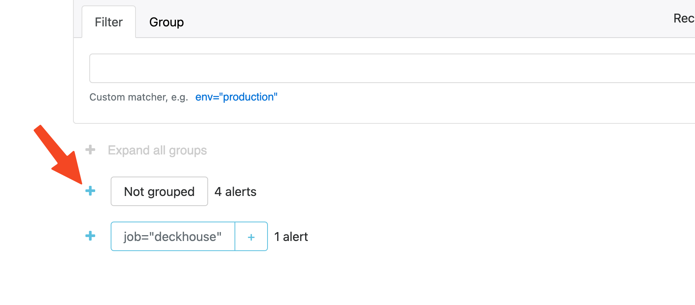

## тест фичи 1

Это тестовая функциональность для демонстрации возможностей модуля.

### Модуль предоставляет следующие возможности:

- Автоматическое сканирование образов контейнеров
- Анализ уязвимостей в режиме реального времени
- Генерация отчетов о безопасности кластера

Для активации функции необходимо добавить метку `security-scanning.deckhouse.io/enabled=""` к пространству имён.

Результаты сканирования доступны в дашбордах Grafana и через Custom Resources кластера.

